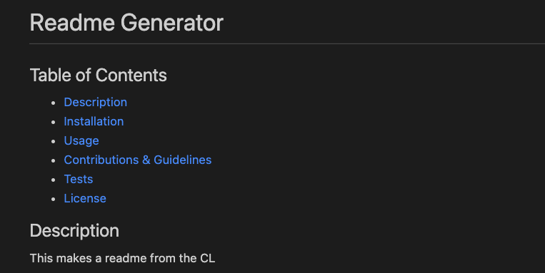

# README Generator

A CL tool that utilizes user input to create a professional README.md file.

## Installation
Download/clone repo
This app requires node.js
Do npm install to install the required dependencies

## User Story
AS A developer I WANT a README generator SO THAT I can quickly create a professional README for a new project

## Screenshots & Video

## Links

Github link: https://github.com/pgamboa322/readme-generator